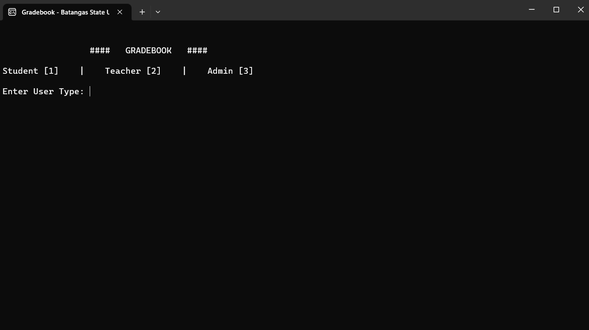
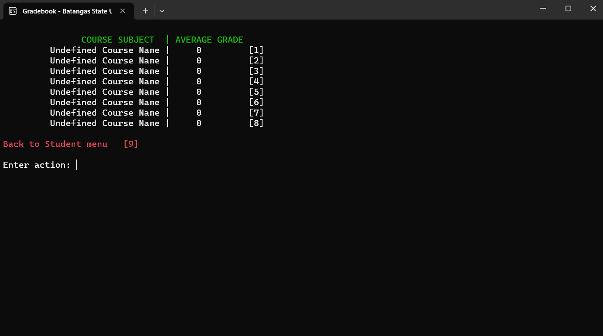
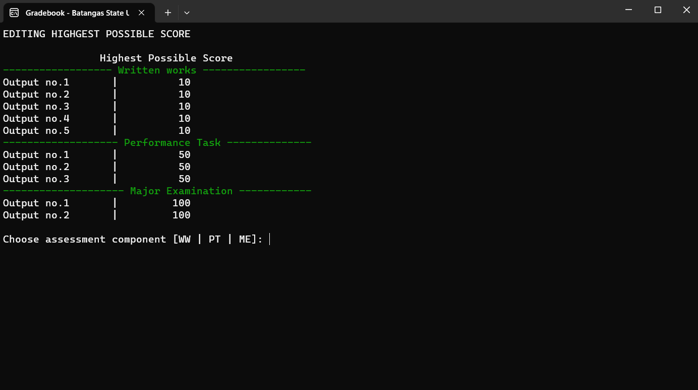
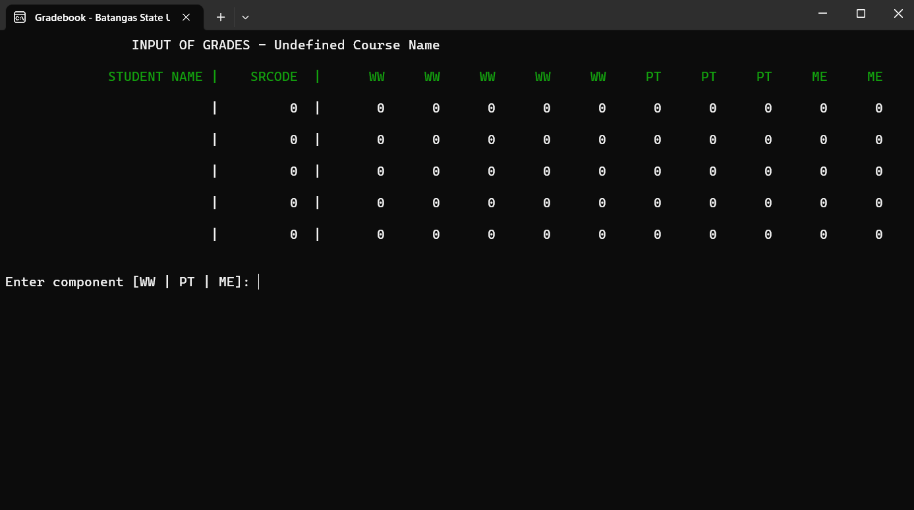
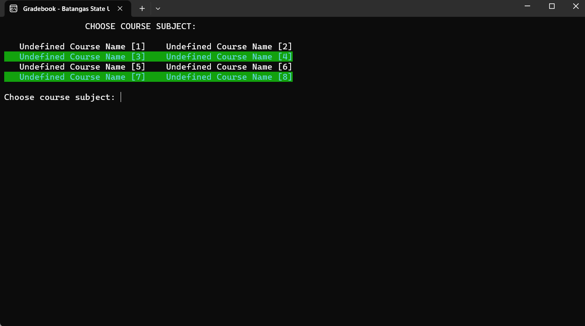

# Gradebook
A simple console-based application built in C++. This application is developed as a requirement during my second year on the course of Advance Computer Programming. 

Note : This application is not fully polished. It has been made as a MVP (Minimum Viable Product) for the purpose of the course's requirement.

## Installation
1. Clone the repository
2. You can either run the application with your IDE or run the executable file in the `output` folder

## Features
- Contains simple user authentication for 3 different users (student, teacher, admin)
- Student can view their grades 
- Teacher can add grades for students
- Admin can add new students and teachers

## Preview

### Main Menu

### Student View 

### Teacher View

### Admin View

